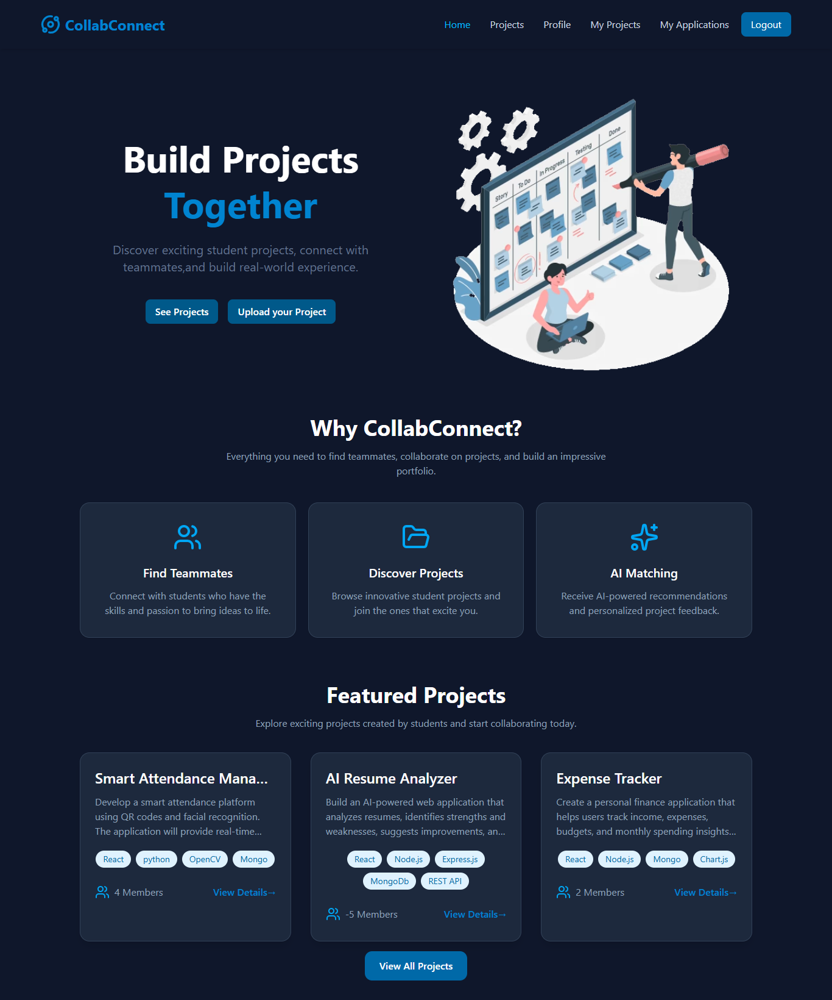
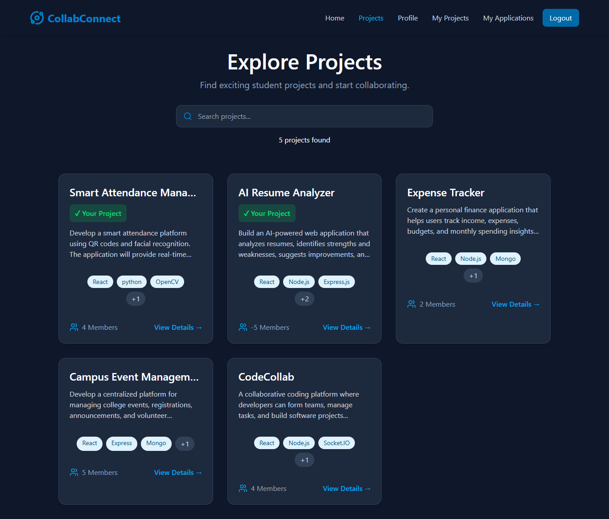
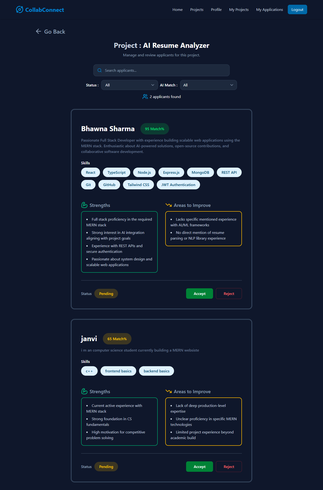
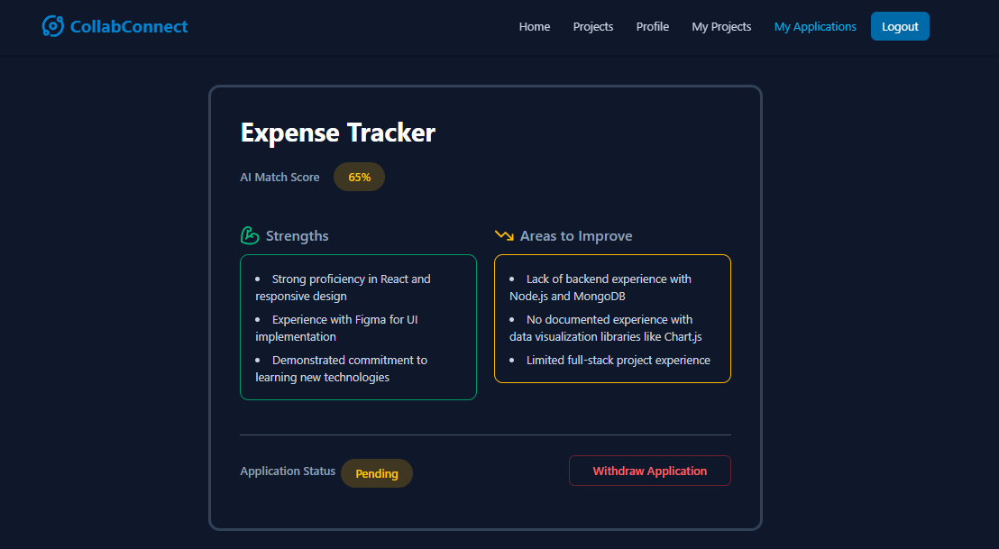
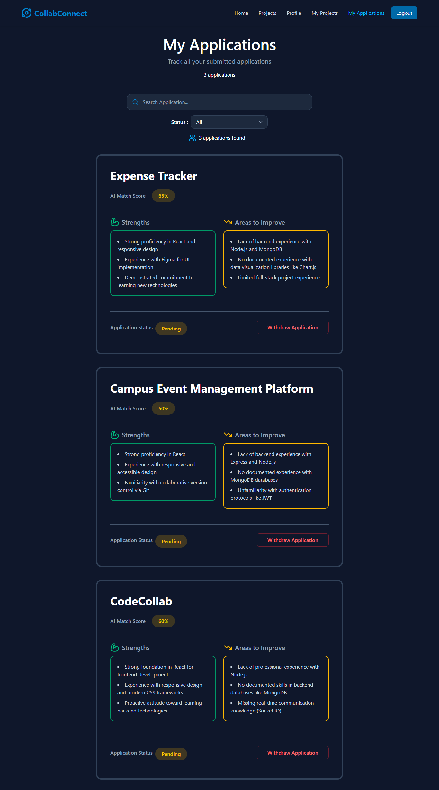
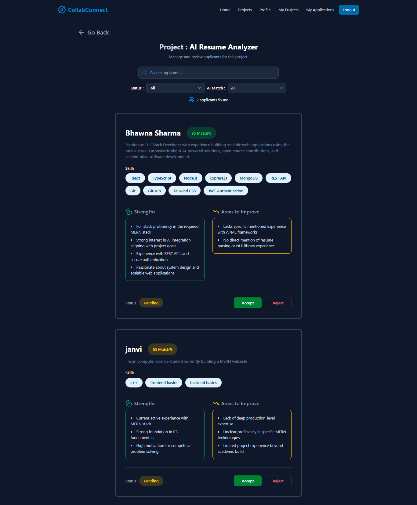
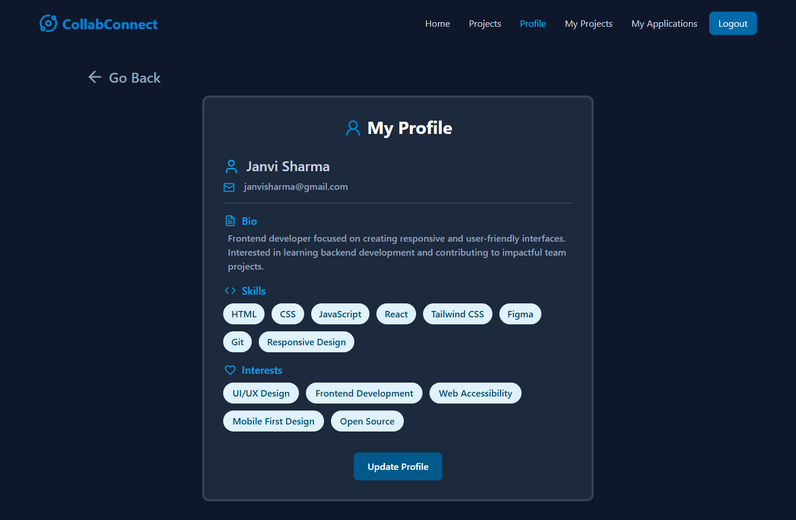

# 🚀 CollabConnect

An AI-powered MERN platform that helps students discover, apply for, and collaborate on projects. CollabConnect streamlines project recruitment by allowing project owners to post opportunities, applicants to showcase their skills, and AI to provide intelligent application analysis.

---

## ✨ Features

### 🔐 Authentication
- User Signup & Login
- JWT-based Authentication
- Secure Password Hashing using bcryptjs
- Protected Routes

### 👤 User Profile
- View Profile
- Update Bio
- Update Skills
- Update Interests

### 📂 Project Management
- Create Projects
- View All Projects
- View Project Details
- View My Projects
- Edit Projects
- Delete Projects

### 📩 Applications
- Apply to Projects
- Prevent Duplicate Applications
- View My Applications
- Withdraw Applications

### 👥 Applicant Management
- View Applicants for a Project
- Accept Applicants
- Reject Applicants
- Application Status Management

### 🤖 AI Integration
- AI-powered Applicant Analysis
- AI Match Score
- Strengths Identification
- Areas for Improvement
- Graceful fallback when AI service is unavailable

### 🎨 User Experience
- Responsive UI
- Active Navigation
- Custom Toast Notifications
- Clean Dark Theme

---

# 🛠️ Tech Stack

### Frontend
- React
- TypeScript
- Vite
- Tailwind CSS
- React Router
- Axios
- Lucide React

### Backend
- Node.js
- Express.js
- MongoDB Atlas
- Mongoose
- JWT Authentication
- bcryptjs

### AI
- Google Gemini API

---

# 📁 Project Structure

```
CollabConnect/
│
├── client/
│   ├── Components/
│   ├── Context/
│   ├── Pages/
│   ├── Services/
│   └── Assets/
│
├── server/
│   ├── Controllers/
│   ├── Middleware/
│   ├── Models/
│   ├── Routes/
│   ├── db/
│   └── server.js
│
└── README.md

---

# 🔗 API Endpoints

## Authentication

| Method | Endpoint |
|---------|----------|
| POST | `/api/auth/signup` |
| POST | `/api/auth/login` |

---

## Users

| Method | Endpoint |
|---------|----------|
| GET | `/api/users/profile` |
| PUT | `/api/users/profile` |

Authentication Required ✅

---

## Projects

| Method | Endpoint |
|---------|----------|
| POST | `/api/projects` |
| GET | `/api/projects` |
| GET | `/api/projects/:id` |
| GET | `/api/projects/my` |
| PUT | `/api/projects/:id` |
| DELETE | `/api/projects/:id` |

---

## Applications

| Method | Endpoint |
|---------|----------|
| POST | `/api/applications/:id/apply` |
| GET | `/api/applications/my` |
| DELETE | `/api/applications/:id` |
| GET | `/api/applications/:id/applicants` |
| PATCH | `/api/applications/:id` |
| PATCH | `/api/applications/:id/analyze` |

Authentication Required ✅

---

# 📸 Screenshots

<h2>🏠 Home Page</h2>
<p align="center"></p>

<h2>📂 Browse Projects</h2>
<p align="center"></p>

<h2>📄 Project Details</h2>
<p align="center"></p>
<p align="center">View complete project information including description, required skills, team size,and apply to projects that match your interests.</p>

<h2>🤖 AI-Powered Applicant Analysis</h2>
<p align="center"></p>

<h2>📩 My Applications</h2>
<p align="center"></p>
<p align="center">Track all submitted applications, monitor their status, and view AI-generated match scores, strengths, and areas for improvement.</p>

<h2>👥 Applicant Management</h2>
<p align="center"></p>

<h2>👤 User Profile</h2>
<p align="center"></p>
<p align="center">Manage your profile by updating your bio, skills, and interests to improve project recommendations and AI evaluation.</p>
---

# 🚀 Future Enhancements (Phase 2)

- Real-time chat between project owners and accepted collaborators
- Notifications
- AI-powered project recommendations
- Remove collaborators
- Email notifications
- Advanced search and filtering

---

# 👩‍💻 Author

**Bhawna Sharma**
**Navya**

Built as part of an internship project using the MERN Stack and Google Gemini AI.